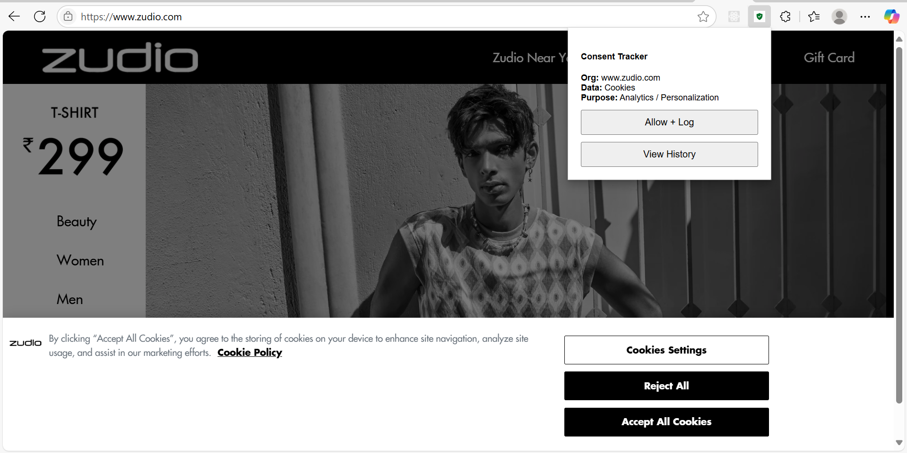

# ConsentApp Chrome Extension 🧠🔒

A lightweight Chrome extension that helps users **track and manage** consent they give to websites — such as cookies, personalization, and data usage — all in one place.

---

## 🔧 Features

- ✅ Detects websites requesting data (like cookies)
- ✅ Pre-fills organization, data type, and purpose
- ✅ Logs consent entries with timestamp
- ✅ View history of consents given
- ✅ Prevents duplicate logs

---

## 📦 Tech Stack

- HTML, CSS, JavaScript
- Chrome Extension API
- Local Storage for consent log tracking

---

## 🧪 How to Install

1. Clone this repo or [Download ZIP](https://github.com/YOUR_USERNAME/ConsentApp-Chrome-Extension/archive/refs/heads/main.zip)
2. Go to `chrome://extensions/`
3. Enable **Developer Mode**
4. Click **"Load Unpacked"**
5. Select the `ConsentApp-Chrome-Extension` folder
6. ✅ You're ready to use it!

---

## 💻 How to Use

1. Visit any website that asks for data consent (e.g., via cookie popup)
2. Click the **ConsentApp** extension icon
3. Click **"Allow + Log"** to store your consent
4. Click **"View History"** to see past consents

---

## 📸 Screenshots

| Website View | 
|--------------|
|  | 

---

## 🚀 Future Scope

- 🔁 Revoke consent functionality
- ☁ Sync with backend (Firebase / MongoDB)
- 📱 Android & iOS privacy app
- 🔒 Blockchain-based consent ledger
- 🔌 API integrations with third-party sites

---

## 📄 License

MIT License

---

> Built with ❤️ by Team KernelMinds
